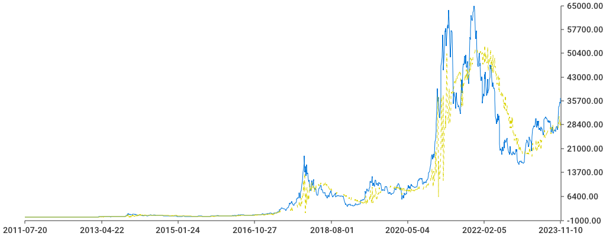

# Bitcoin Price Forecasting Tool

## Description

This tool is designed to forecast Bitcoin prices by leveraging historical data on Bitcoin's market price and the total Bitcoins in circulation. It utilizes a linear regression model to predict future prices, providing valuable insights into market trends.


## How It Works

### Data Processing
- **Data Loading**: The program begins by loading historical data from JSON files. This data encompasses market prices and total Bitcoins in circulation over time.
- **Data Filtering**: To enhance the accuracy of predictions, the data is filtered based on a specified time range. This ensures the model focuses on relevant data points for forecasting.
```Go
func filterData(data BlockchainData, startYear, endYear int) BlockchainData {
	filtered := BlockchainData{}
	for _, entry := range data.MarketPrice {
		year := time.Unix(entry.X/1000, 0).Year()
		if year >= startYear && year <= endYear {
			filtered.MarketPrice = append(filtered.MarketPrice, entry)
		}
	}
	for _, entry := range data.TotalBitcoins {
		year := time.Unix(entry.X/1000, 0).Year()
		if year >= startYear && year <= endYear {
			filtered.TotalBitcoins = append(filtered.TotalBitcoins, entry)
		}
	}
	return filtered
}
```

### Forecasting Model
- **Rolling Window Approach**: The forecasting model employs a rolling window approach to analyze data segments sequentially, allowing for dynamic adaptation to new data.
```Go
func rollingWindowForecast(data BlockchainData, windowSize int) ([]float64, []time.Time) {
	var forecastedPrices []float64
	var timestamps []time.Time
	var sumIntercept, sumSlopePrice, sumSlopeVolume float64
	var allParams AllModelParameters

	numberOfModels := 0

	for i := windowSize; i < len(data.MarketPrice); i++ {

		windowPrices := make([]float64, windowSize)
		windowVolumes := make([]float64, windowSize)
		for j := 0; j < windowSize; j++ {
			windowPrices[j] = data.MarketPrice[i-windowSize+j].Y
			windowVolumes[j] = data.TotalBitcoins[i-windowSize+j].Y
		}

		predictedPrice, intercept, slopePrice, slopeVolume := trainAndForecast(windowPrices, windowVolumes)

		sumIntercept += intercept
		sumSlopePrice += slopePrice
		sumSlopeVolume += slopeVolume

		numberOfModels++

		forecastedPrices = append(forecastedPrices, predictedPrice)
		timestamps = append(timestamps, time.Unix(data.MarketPrice[i].X/1000, 0))
		params := ModelParameters{
			Intercept:   intercept,
			SlopePrice:  slopePrice,
			SlopeVolume: slopeVolume,
			StartDate:   time.Unix(data.MarketPrice[i-windowSize].X/1000, 0),
			EndDate:     time.Unix(data.MarketPrice[i].X/1000, 0),
		}

		allParams.Parameters = append(allParams.Parameters, params)

	}

	saveModelParameters(allParams, "model_parameters.json")

	modelsCount := float64(len(data.MarketPrice) - windowSize)
	avgSlopePrice := sumSlopePrice / modelsCount
	avgSlopeVolume := sumSlopeVolume / modelsCount

	fmt.Printf(" SlopePrice: %f, SlopeVolume: %f\n", avgSlopePrice, avgSlopeVolume)

	return forecastedPrices, timestamps
}
```
- **Linear Regression**: For each data segment within the rolling window, a linear regression model is trained. This model identifies relationships between market prices, the total number of Bitcoins, and their impact on future prices.
```Go
func trainAndForecast(prices []float64, volumeDiffs []float64) (float64, float64, float64, float64) {
    priceDifferences := calculateDifferences(prices)
    volume := calculateDifferences(volumeDiffs)

    // Linear regression logic to calculate the predicted price
    predictedPrice, intercept, slopePrice, slopeVolume := linearRegression(prices[1:], priceDifferences, volume)

    return predictedPrice, intercept, slopePrice, slopeVolume
}
```
- **Parameter Calculation**: The model calculates key parameters, including intercept, slope for price, and slope for volume, which are crucial for making predictions.
```Go
func linearRegression(y, x1, x2 []float64) (float64, float64, float64) {
    X := mat.NewDense(len(y), 3, nil)
    Y := mat.NewVecDense(len(y), y)

    for i := 0; i < len(y); i++ {
        X.Set(i, 0, 1)  // Intercept term
        X.Set(i, 1, x1[i])  // Slope for price
        X.Set(i, 2, x2[i])  // Slope for volume
    }

    var coef mat.Dense
    qr := new(mat.QR)
    qr.Factorize(X)
    qr.SolveTo(&coef, false, Y)

    intercept := coef.At(0, 0)
    slopePrice := coef.At(1, 0)
    slopeVolume := coef.At(2, 0)

    return intercept, slopePrice, slopeVolume
}
```
### Performance Evaluation
- **Forecast Generation**: After training, the model generates forecasts for Bitcoin prices and compares them with actual historical prices.
```Go
func calculateMSE(actual, predicted []float64) float64 {
    var sumError float64
    for i := range actual {
        predictionError := predicted[i] - actual[i]
        sumError += predictionError * predictionError
    }
    meanSquaredError := sumError / float64(len(actual))
    return meanSquaredError
}
```
- **Error Metrics**: The model evaluates its performance by calculating the Mean Squared Error (MSE) and Mean Absolute Percentage Error (MAPE), providing insights into its accuracy.
```Go
func calculateMAPE(actual, predicted []float64) float64 {
    var sumError float64
    for i := range actual {
        if actual[i] != 0 {
            sumError += math.Abs((actual[i] - predicted[i]) / actual[i])
        }
    }
    meanAbsolutePercentageError := (sumError / float64(len(actual))) * 100
    return meanAbsolutePercentageError
}
```


